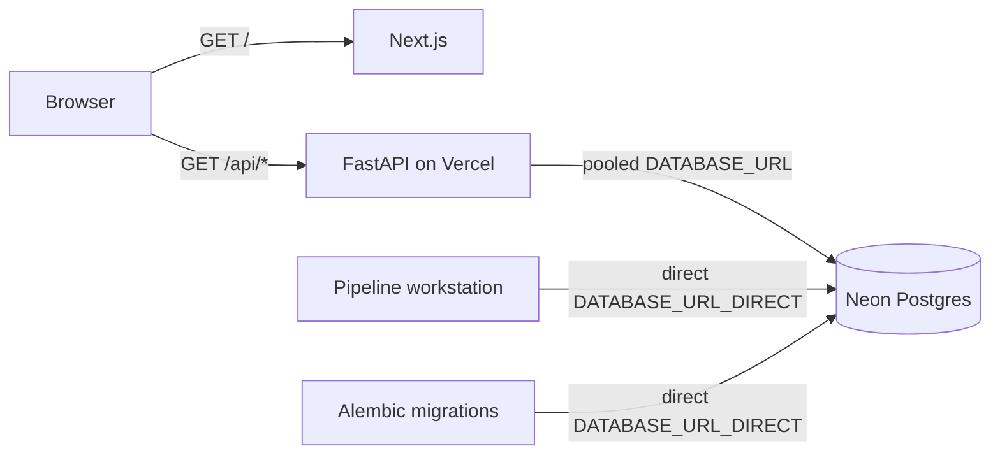

# Parcel Panda

Parcel Panda is a real-estate data application that combines a Next.js frontend,
a FastAPI backend, and Neon Postgres in one Vercel deployment. A separate Python
pipeline environment handles heavyweight geospatial and data-processing work
without adding those dependencies to the deployed application.

Live application: [parcel-panda.vercel.app](https://parcel-panda.vercel.app/)

## Architecture



Vercel serves both runtimes from one domain:

- `/` is rendered by Next.js.
- `/api/health` and `/api/properties` are handled by FastAPI.
- `vercel.json` rewrites `/api/*` requests to the Python entrypoint.
- FastAPI reads application data from Neon through its pooled endpoint.
- Alembic and offline pipelines connect directly to Neon for session-level and
  high-volume operations.

### Database connections

| Variable | Connection | Used by |
| --- | --- | --- |
| `DATABASE_URL` | Neon pooled endpoint (`-pooler`) | FastAPI and Vercel request traffic |
| `DATABASE_URL_DIRECT` | Neon direct endpoint | Alembic migrations and pipeline jobs |

SQLAlchemy uses Psycopg 3 and `NullPool` in the web application. Neon/PgBouncer
provides the shared connection pool, so ephemeral Vercel processes do not retain
their own persistent SQLAlchemy pools.

## Repository layout

```text
parcel-panda/
├── app/                       # Next.js App Router frontend
├── api/
│   └── index.py               # FastAPI/Vercel entrypoint
├── backend/
│   ├── database.py            # SQLAlchemy engine and sessions
│   ├── models.py              # Property model
│   ├── schemas.py             # API response schemas
│   └── routes/                # FastAPI route modules
├── alembic/                   # Database migrations
├── pipelines/
│   ├── ingest_properties.py   # Direct-to-Neon ingestion job
│   ├── requirements.txt       # Heavy data/geospatial dependencies
│   ├── sources/               # Source-specific ingestion code
│   └── transforms/            # Data normalization and transforms
├── neon.ts                    # Neon branch and service policy
├── requirements.txt           # Lightweight Vercel Python dependencies
└── vercel.json                # Same-domain API routing
```

The root Python environment stays intentionally small. Packages such as Pandas,
GeoPandas, PyArrow, NumPy, and Shapely live only in `pipelines/.venv` and are not
installed in the Vercel runtime.

## Deployment and operations

See [DEPLOYMENT.md](./DEPLOYMENT.md) for complete instructions covering local
environments, Neon configuration, migrations, pipeline execution, Vercel setup,
production deployment, and smoke testing.

## API

### `GET /api/health`

Returns basic service health:

```json
{
  "status": "ok",
  "service": "parcel-panda-api"
}
```

### `GET /api/properties`

Returns the properties currently stored in Neon. FastAPI's generated OpenAPI and
Swagger documentation is available at `/docs` when the Python application is run
directly.
