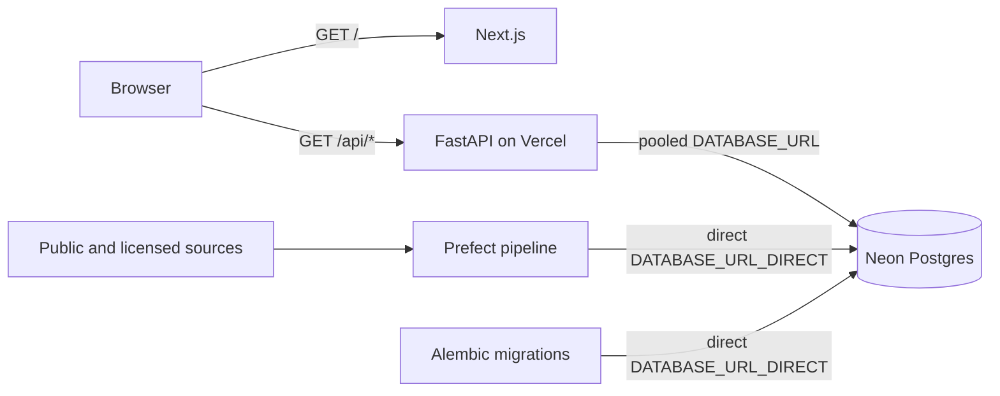

# Parcel Panda

Parcel Panda is a real-estate data application that combines a Next.js frontend,
a FastAPI backend, and Neon Postgres in one Vercel deployment. A separate Python
pipeline environment handles heavyweight geospatial and data-processing work
without adding those dependencies to the deployed application.

Live application: [parcel-panda.vercel.app](https://parcel-panda.vercel.app/)

## Architecture



Vercel serves both runtimes from one domain:

- `/` is rendered by Next.js.
- `/api/health` and `/api/properties` are handled by FastAPI.
- `vercel.json` rewrites `/api/*` requests to the Python entrypoint.
- FastAPI reads application data from Neon through its pooled endpoint.
- Alembic and offline pipelines connect directly to Neon for session-level and
  high-volume operations.

### Database connections

| Variable | Connection | Used by |
| --- | --- | --- |
| `DATABASE_URL` | Neon pooled endpoint (`-pooler`) | FastAPI and Vercel request traffic |
| `DATABASE_URL_DIRECT` | Neon direct endpoint | Alembic migrations and pipeline jobs |

SQLAlchemy uses Psycopg 3 and `NullPool` in the web application. Neon/PgBouncer
provides the shared connection pool, so ephemeral Vercel processes do not retain
their own persistent SQLAlchemy pools.

## Repository layout

```text
parcel-panda/
├── app/                       # Next.js App Router frontend
├── api/
│   └── index.py               # FastAPI/Vercel entrypoint
├── backend/
│   ├── database.py            # SQLAlchemy engine and sessions
│   ├── models.py              # Property model
│   ├── schemas.py             # API response schemas
│   └── routes/                # FastAPI route modules
├── alembic/                   # Database migrations
├── pipelines/
│   ├── __main__.py            # Dry-run-first command-line interface
│   ├── flow.py                # Prefect orchestration flow
│   ├── catalog.py             # Dataset and source registry
│   ├── contracts.py           # Normalized ingestion records
│   ├── requirements.txt       # Heavy data/geospatial dependencies
│   └── sources/               # Source adapters and pure normalization helpers
├── neon.ts                    # Neon branch and service policy
├── requirements.txt           # Lightweight Vercel Python dependencies
└── vercel.json                # Same-domain API routing
```

The root Python environment stays intentionally small. Packages such as Pandas,
GeoPandas, PyArrow, NumPy, and Shapely live only in `pipelines/.venv` and are not
installed in the Vercel runtime.

## Data pipelines

The catalog pipelines run outside Vercel and use Prefect for orchestration,
retries, and observable task/flow runs. They normalize source-specific records,
retain source provenance when requested, and use content hashes plus database
constraints to make repeated ingestion idempotent.

Install the pipeline environment, copy `.env.example` to the ignored
`.env.local`, and load its values:

```bash
python3 -m venv pipelines/.venv
source pipelines/.venv/bin/activate
python -m pip install -r pipelines/requirements-dev.txt
set -a
source .env.local
set +a
```

Every command is a dry run unless `--write` is present:

```bash
# Preview the default public starter set without changing Postgres.
python -m pipelines

# Preview selected Wake County datasets with a small source limit.
python -m pipelines \
  --dataset parcel-records \
  --dataset housing-demographics \
  --county-fips 37183 \
  --limit 100

# Persist the same normalized records after reviewing the dry-run summary.
python -m pipelines \
  --dataset parcel-records \
  --county-fips 37183 \
  --limit 100 \
  --write
```

Dry-run mode prevents database mutation; it still calls selected upstream APIs
and can consume provider quota. Keep `--limit` small while iterating.

Use `--no-raw-payloads` when source payload retention is unnecessary. Run
`python -m pipelines --help` for every dataset slug and option. Write runs need
`DATABASE_URL_DIRECT`; Census and RentCast adapters read `CENSUS_API_KEY` and
`RENTCAST_API_KEY`, respectively. Never expose those values to the Next.js
client or commit them.

The catalog is transparent about source boundaries: county parcel schemas and
update schedules vary, municipal zoning is not statewide, flood layers describe
mapped hazards rather than property-specific risk, mortgage data is aggregated
rather than loan-level, and licensed listing coverage depends on the provider.
Absence from a source is not proof that a property or condition does not exist.

## Deployment and operations

See [DEPLOYMENT.md](./DEPLOYMENT.md) for complete instructions covering local
environments, Neon configuration, migrations, pipeline execution, Vercel setup,
production deployment, and smoke testing.

## API

### `GET /api/health`

Returns basic service health:

```json
{
  "status": "ok",
  "service": "parcel-panda-api"
}
```

### `GET /api/properties`

Returns the properties currently stored in Neon. FastAPI's generated OpenAPI and
Swagger documentation is available at `/docs` when the Python application is run
directly.
